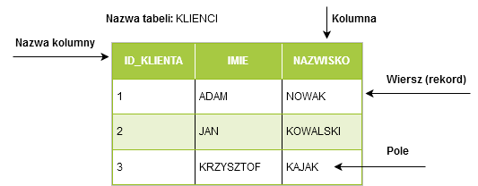
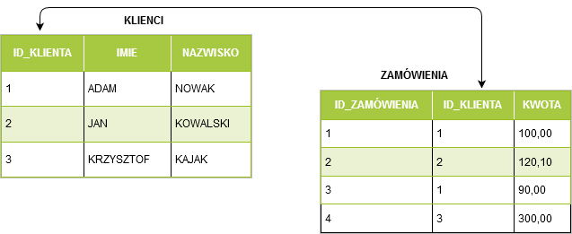
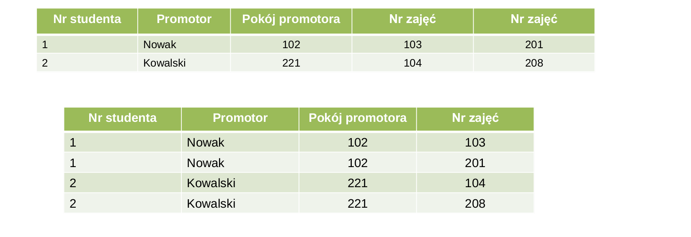
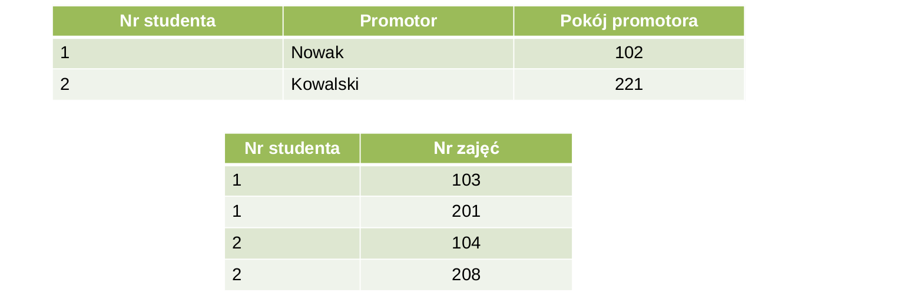
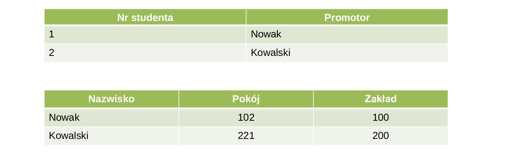

#### Bazy danych


---
###### Czym są relacyjne bazy danych?

Relacyjne bazy danych służą do przechowywania danych połączonych ze sobą relacjami. <br/> Charakterystyczne cechy baz danych to:

* Szybkie wyszukiwanie informacji
* Przechowywanie dużej ilości danych na małej powierzchni
* Prosta analiza zgromadzonych danych
* Przystępny dostęp i możliwość dostępu zdalnego
* Łatwe tworzenie kopii zapasowych
* Ułatwione zachowywanie spójności danych

---

###### CRUD

Skrót **CRUD** oznacza cztery podstawowe operacje wykonywane na
danych implementowane w aplikacjach bazodanowych
* **C – create** (tworzenie)
* **R – read** (odczyt)
* **U – update** (aktualizacja)
* **D – delete** (usuwanie)

---

###### Tabela

**Tabela** to wydzielony logicznie zbiór danych, zorganizowanych w formie zbioru składającego się z wierszy dzielonych na kolumny.



---

###### Relacja

**Relacja** to logiczne połączenie pomiędzy między tabelami.



---

###### Klucz główny


Do jednoznacznej identyfikacji wierszy stosuje klucz główny (*ang. primary key*), czyli jedną z kolumn lub ich grupę, których wartości są unikatowe w całej tabeli (dzięki czemu jednoznacznie identyfikują wiersz(*ang. row*)).

###### Klucz obcy

Innym rodzajem klucza jest tzw. klucz obcy (*ang. foreign key*). Służy do definiowania zależności pomiędzy danymi przechowywanymi w różnych tabelach. 

---

##### Typy danych SQL

Każda kolumna w tabeli musi posiadać określony typ:

* **Tekst** - CHAR, VARCHAR, BLOB, TEXT, ENUM, SET,...
* **Liczby całkowite** - BIT, TINYINT, BOOLEAN, SMALLINT, ...
* **Liczby zmiennoprzecinkowe** - DOUBLE, DECIMAL, ...
* **Data i czasu** - DATE, TIME, DATETIME, ...
* **Specjalne** - na przykład JSON

---

### **<span style="color:salmon">S</span>tructured <span style="color:salmon">Q</span>uery <span style="color:salmon">L</span>anguage**

Większość współczesnych relacyjnych baz danych korzysta z jakiejś wersji języka **SQL** pozwalającego wprowadzać zmiany w strukturze bazy danych, jak również zmiany danych w bazie i wybieranie informacji z bazy danych. 

Język ten opiera się na silniku bazy danych, który pozwala zadawać w języku **SQL** pewnego rodzaju pytania (kwerendy) i wyświetlać dane, które spełniają warunki zapytania. 

Zapytania **SQL** mogą także wykonywać operacje wstawiania danych, usuwania danych i ich aktualizacji. Język **SQL** zapewnia również zarządzanie bazą danych.

* **SQL** został stworzony w latach 70 w IBM.
* W roku 1986 została wydana pierwsza wersja standardu **ANSI-SQL**.
* Najnowsza wersja standardu to **SQL:2016**.

---

###### Podstawowe instrukcje to:

Instrukcja  ``@@@SHOW DATABASES;@@@`` wyświetla bazy danych na serwerze. =>
Polecenie  ``@@@USE@@@ [nazwa bazy danych]@@@;@@@`` wybiera bazę danych. =>
Polecenie  ``@@@SHOW TABLES;@@@`` wyświetla tabele w wybranej bazie danych. =>
Instrukcja  ``@@@DESC@@@ [nazwa tabeli]@@@;@@@`` wyświetla detale tabeli.

---

Do bazy danych możemy łaczyć się przez narzędzia takie jak **MySQL Workbench**,
**IntelliJ** lub przez linię poleceń korzystając z narzędzia **mysql**.

Aby połączyć z bazą danych przy pomocy **mysql** używamy polecenia:

`mysql -u @@@[użytkownik]@@@ -p'@@@[hasło]@@@' -h @@@[adres hosta]@@@ -P @@@[port]@@@ -D @@@[nazwa bazy]@@@`

`mysql -u @@@school_user@@@ -p'@@@pass@@@' -h @@@0.0.0.0@@@ -P @@@3306@@@ -D @@@school@@@`

---

##### Komentarze

Komentarze w **SQL** pozwalają na dodawanie dodatkowych informacji do 


`@@@#@@@ jednoliniowy`

`@@@--@@@ jednoliniowy`

`@@@/*@@@ 
   blokowy
   wieloliniowy
 @@@*/@@@`


---

### Data Manipulation Language

---

##### Dodawanie danych

`
@@@INSERT INTO@@@ [nazwa_tabeli]([kolumny...]) @@@VALUES@@@ ([wartości...])
`
```sql
INSERT INTO department(id, name, city) VALUES(10, 'ACCOUNTING', 'NEW YORK');
INSERT INTO department VALUES(11, 'LEGAL', 'LOS ANGELES');
```

Możemy też wykonywać **INSERT** za pomocą danych zwróconych przez zapytanie:

```sql
INSERT INTO department SELECT DEPTNO, DNAME, LOC FROM migrated_department
```
---

##### Skąd sie biorą id?
Możemy jawnie zadeklarowąć jaki **id** ma zostać użyty w insercie.
```sql
INSERT INTO department(id, name) VALUES(10, 'ACCOUNTING')
```

Możemy też pozostawić na bazie danych obowiązek wygenerowania klucza.
Strategia generowania klucza zależy od bazy danych:
  
* poprzez wywołanie sekwencji (dla **Oracle**, **PostgreSQL**, itd.):
```sql
INSERT INTO department(id, name) VALUES(dep_seq.nextval, 'ACCOUNTING')
``` 
  
* poprzez stworzenie autoinkrementującej się kolumny (dla **MySQL**, **MariaDB**, itd.) oraz pozostawienie kolumny w **insercie** pustej:
```sql
INSERT INTO department(name) VALUES('ACCOUNTING')
```


---

##### Uaktualnianie danych

`
@@@UPDATE@@@ [nazwa tabeli]
@@@SET@@@ [nazwa_kolumny1]=[wartość1], [nazwa_kolumny2]=[wartość2], ...
@@@WHERE@@@ [predykat]
`
```sql
UPDATE department
SET dept_name = ’Sales’,
manager = ’Zosia’
WHERE dept_name = ’Finance’
```
```sql
UPDATE department AS src, department AS target 
SET target.description = src.description
WHERE target.manager_id = src.manager_id
```

---

##### Usuwanie danych:

Aby usunąć konkretne dane używamy **DELETE**:

```sql
DELETE FROM students WHERE id = 9
```

**TRUNCATE** usuwa wszystkie dane z tabeli i resetuje autoinkrementujące się wartości/sekwencje.

```sql
TRUNCATE TABLE students
```

Note: Truncate kasuje też sekwencje, delete będzie wymagać WHERE

---

##### Transakcje

**Transakcja** to zbiór operacji wykonywanych na bazie danych traktowanych jako jedna całość.

Transakcje uznaje się za zakończoną pomyślnie jeśli udało się prawidłowo
wykonać **wszystkie** wchodzące w jej skład operacje.
Jeśli którakolwiek z operacji zakończyła się niepowodzeniem, to całą transakcję
uznaje się za wykonaną nieprawidłowo.

Poprawna transakcja jest **zatwierdzana** w bazie danych (ang.&nbsp;*committed*),
a wprowadzone przez nią zmiany są widoczne dla innych procesów bazy danych.
Niepoprawna transakcja natomiast jest wycofywana (ang. *rolled-back*),
a wszystkie wprowadzone przez nią zmiany są anulowane.

---

Transakcję rozpoczynamy wyrażeniem **START TRANSACTION**, a zatwierdzamy **COMMIT**:

```sql
START TRANSACTION;

INSERT INTO users VALUES('Adam', 'Smith');
INSERT INTO users VALUES('Adam', 'Johnson');

COMMIT;
```

Możemy też odwołać transakcję używając słowa kluczowego **ROLLBACK**:

```sql
START TRANSACTION;

UPDATE users SET name = 'John' WHERE last_name = 'Smith';
UPDATE users SET name = 'George' WHERE last_name = 'Johnson';

ROLLBACK;
```

Po wywołaniu **ROLLBACK** baza danych wraca do stanu sprzed rozpoczęcia transakcji.

---

##### ACID

**ACID** to zbiór właściwości gwarantujących poprawne przetwarzanie transakcji w bazach danych.

---

Skrótowiec **ACID** rozwijamy jako:

* **Niepodzielnosć** (ang. *atomicity*) oznacza, że wszystkie operacje wchodzące w skład transakcji muszą zostać
wykonane poprawnie. W przeciwnym przypadku wszyskie operacje zostaną wycofane.
* **Spójność** (ang. *consistency*) Jeżeli nie powiedzie się zmiana stanu bazy danych to 
wraca ona do stanu sprzed rozpoczęcia transakcji (stanu spójnego).
* **Izolacja** (ang. *isolation*) oznacza, że wszystkie operacje wykonywane w ramach jednej 
transakcji muszą zostać odseparowane od reszty systemu aż do zatwierdzenia transakcji.
* **Trwałość** (ang. *durability*) oznacza, że  zatwierdzane dane muszą być zapisane w sposób
trwały, tak aby w przypadku awarii istniała możliwość przywrócenia zawartości bazy do prawidłowego stanu.

---

Standard **SQL-92** definiuje następujące cztery poziomu izolacji transakcji:
* **Read uncommited** - transakcja może czytać niezatwierdzone dane czyli dane zmienione przez inną transakcję, która jest dalej wykonywana.
* **Read commited** - transakcja nie może czytać niezatwierdzonych danych. Dane aktualnie zmieniane przez inne transakcje nie mogą być odczytywane.
* **Repetable read** - transakcja nie może zmieniać danych odczytywanych przez inną transakcję.
* **Serializable** -transakcja ma wyłączność na odczyt i aktualizację danych. Inne transakcje nie mogą ani odczytywać, ani zapisywać tych samych
danych. Transakcja blokuje przetwarzany zakres wierszy aż do momentu jej zakończenia.

---

### Data Query Language

**Data Query Language** pozwala na pobieranie wierszy z tabel bazy danych.

---

Podstawowe zapytanie  **SQL** pozwala pobrać kolumny z danej tabeli za pomocą słów kluczowych **SELECT** i **FROM**:


`@@@SELECT@@@ [kolumny] @@@FROM@@@ [tabela]`


Na przykład możemy pobrać dane z tabeli **students**:

```sql
SELECT * FROM students; ||1||
SELECT id, first_name FROM students; ||2||
```

||1|| Używająć **\*** pobieramy wszystkie kolumny z tabeli. =>
||2|| Pobieramy tylko kolumny **id** oraz **first_name**.

---

Możemy ograniczyć liczbę wyników za pomocą **LIMIT** oraz przesuwać punkt startu za pomocą **OFFSET**.

`@@@SELECT * FROM@@@ [nazwa_tabeli] @@@LIMIT@@@ [ilość_wierszy] @@@OFFSET@@@ [punkt startu]@@@;@@@`


```sql
SELECT * FROM students LIMIT 5 OFFSET 5;
```

Możemy rówież usunąć duplikaty za pomocą **DISTINCT**.

```sql
SELECT DISTINCT first_name FROM students;
```

---

Aby nadać kolumnie inną nazwę (alias) używamy słowa kluczowego **AS** (można też je ominąć):

`@@@SELECT@@@ [nazwa_kolumn] @@@AS@@@ [nowa_nazwa] @@@FROM@@@ [nazwa_tabeli]`;
`@@@SELECT@@@ [nazwa_kolumn] [nowa_nazwa] @@@FROM@@@ [nazwa_tabeli]`;

```sql
SELECT first_name AS imię FROM students;
SELECT first_name imię FROM students;
```
---
Aby ustalić kolejność wyników należy użyć słowa kluczowego **ORDER BY**:

`@@@SELECT * FROM@@@ [nazwa_tabeli] @@@ORDER BY@@@ [nazwa_kolumny1, nazwa_kolumny2, ...]@@@;@@@`


```sql
SELECT * FROM students ORDER BY age, first_name;
```

Możemy kontrolować koleność sortowania danych za pomocą słów **ASC** - kolejność roznąca
oraz **DESC** malejąca. **ASC** jest domyślną kolejnością.

```sql
SELECT * FROM students ORDER BY age DESC;
```

---

###### Predykaty i filtrowanie danych
Pobierane dane możemy filtrować za pomocą słowa kluczowego **WHERE** do którego przekazujemy predykat:

**=** i **<>** - operatory *równa się* i *różni się*. 
```sql
SELECT * FROM students WHERE id = 9;
```
**>**, **>=**, **<**, **<=** to operatory porównania.
```sql
SELECT * FROM students WHERE age > 10;
```
**IN** - operator sprawdzający czy wartość należy do zbioru.

```sql
SELECT * FROM students WHERE name IN ('Jerzy', 'Kazimierz');
```

**BETWEEN** sprawdzający czy wartość jest w zakresie.
 ```sql
 SELECT * FROM students WHERE age BETWEEN 15 AND 17;
 ```
---

**LIKE** porównujący tekst z innym wyrażeniem tekstowym zawierającym znaki uniwersalne @@@%@@@ (znak procenta), @@@_@@@ (znak podkreślenia)
```sql
SELECT * FROM students WHERE name LIKE 'St_fan';
SELECT * FROM students WHERE name LIKE 'Stefa%';
SELECT * FROM students WHERE name LIKE '%efan';
SELECT * FROM students WHERE name LIKE '%efa%';
```
Predykaty mogą być łączone za pomocą **OR** albo **AND**.
```sql
SELECT * FROM students WHERE id = 9 OR id = 8;
SELECT * FROM students WHERE first_name = 'Stefan' AND last_name= 'Bijak';
```
Możemy również negować predykaty za pomocą **NOT**.
```sql
SELECT * FROM students WHERE id NOT BETWEEN 3 AND 6;
```
---

#### NULL

**NULL** to specjalny znacznik w języku **SQL**, wskazujący, że dana nie istnieje w bazie danych.
Aby kolumna mogła przyjnować wartości **NULL** musi mieć ustawiony atrybut **NULLABLE**.

Filtrując po wartości **NULL** musimy korzystać ze specjalnego predykatu **IS / IS NOT**:

```sql
SELECT * FROM students WHERE age IS NOT NULL;
SELECT * FROM students WHERE age IS NULL;
```

---
##### Funkcje SQL

Na kolumnach możemy wykonywać operacje używając funkcji:  


`@@@SELECT@@@ [nazwa_funkcji(kolumna)] @@@FROM@@@ [tabela]@@@;@@@`

Na przykład funkcja **LENGTH** zwraca długość tekstu w danej kolumnie:

```sql
SELECT LENGTH(first_name) AS name_length FROM students;
```

---
Podstawowe funkcje związane z tekstem:

* **CONCAT(argument1, ...)** - łączy ze sobą łańcuchy tekstowe.
```sql
SELECT CONCAT(p.prefix, '-', p.number) FROM phone p;
```
* **LENGTH(argument)** - zwraca długość argumentu.
* **SUBSTRING(argument,pozycja, długość)** - zwraca argument począwszy od wskazanej pozycji o zadanej ilości znaków.
```sql
SELECT SUBSTRING('raz dwa trzy', 5, 3);
 ```
* **LOWER(argument)** - zwraca argument pisany małymi literami.
* **UPPER(argument)** - zwraca argument pisany dużymi literami.
* **REPLACE(tekst, do_zamienienia, zamiennik)** - zamienia tekst.
```sql
SELECT REPLACE('raz dwa', 'raz', 'zero'); -- zero dwa
```
* **LPAD(argument, długość, znaki)** - zwraca argument uzupełniony do lewej strony określonym ciągiem znaków.
```sql
SELECT LPAD('123', '6', '0'); -- 000123
```
* **LTRIM(argument)** - usuwa znaki spacji z lewej strony argumentu.
* **RPAD(argument, długość, znaki)** - zwraca argument uzupełniony do prawej strony określonym ciągiem znaków.
* **RTRIM(argument)** - usuwa znaki spacji z prawej strony argumentu.

---

Podstawowe funkcje związane z datą i czasem:

* **CURRENT_DATE()** - zwraca bieżącą datę.
* **CURRENT_TIME()** - zwraca bieżący czas.
* **CURRENT_DATETIME()** albo **NOW()** - zwraca bieżącą datę z czasem.
* **DATE(argument)** - zwraca datę z przekazanego tekstu.
```sql
SELECT DATE('2019-04-04');
```
* **DATE_ADD(data, interwał)** - dodaje określony interwał do daty.
```sql
SELECT DATE_ADD(date, INTERVAL 20 DAY);
```
* **DATEDIFF(wyrażenie_1,wyrażenie_2)** - zwraca ilość dni pomiędzy datami przekazanymi jako argumenty funkcji.
  ```sql
  SELECT DATEDIFF(date, CURRENT_DATE());
  ```
* **MONTH(data)** - pobiera miesiąc z przekazanego argumentu.
```sql
SELECT MONTH(date);
```
* **EXTRACT(wyrażenie)** - wyciąga element z daty.
```sql
SELECT EXTRACT(DAY FROM CURRENT_DATE());
```

---

Datę możemy formatować za pomocą funkcji **DATE_FORMAT**:

```sql
SELECT DATE_FORMAT('2017-06-15', '%M %d %Y'); -- June 15 2
SELECT DATE_FORMAT('2017-06-15', '%W %M %e %Y'); -- Thursday June 15 2017
SELECT DATE_FORMAT(birthdate, '%d.%m.%Y') FROM employees; -- 18.12.1988
```

Przykładowe znaczniki:

| Znacznik  | Co oznacza?                    | Przykład       |
|-----------|--------------------------------|----------------|
| **%Y**    | Rok w formacie czterocyfrowym  | 1988           |
| **%M**    | Pełna nazwa miesiąca           | September      |
| **%m**    | Numer miesiąca (01 - 12)       | 04             |
| **%d**    | Dzień miesiąca                 | 12             |
| **%H**    | Godzina (0 - 23)               | 12             |
| **%i**    | Minuta (0 - 59)                | 43             |
| **%s**    | Sekunda (0 - 59)               | 23             |

---

Podstawowe funkcje związane z liczbami

* **RAND()** - zwraca losową liczbę.
* **ABS(liczba)** - zwraca moduł z liczby.
* **SQRT(liczba)** - zwraca pierwiastek z liczby.
```sql
SELECT SQRT(25) -- 5
```
* **ROUND(liczba)** - zaokrągla liczbę do najbliższej liczby całkowitej.
```sql
SELECT ROUND(5.6) -- 6
```
* **FORMAT(liczba, ilość_miejsc)** - zaokrągla liczbę, do ilości miejsc po przecinku. 
```sql
SELECT FORMAT(3.355555, 2) -- 3.36
``` 
---

I inne:

* **GREATEST(arg1, arg2, ...)** - zwraca największy element.
```sql
SELECT GREATEST('zero', 'raz', 'dwa')
```
* **LEAST(arg1, arg2, ...)** - zwraca najmniejszy element element.
* **COALESCE(arg1, arg2, ...)** - zwraca pierwszy argument, który nie jest nullem.
```sql
SELECT 
    COALESCE(d.short_desc, d.long_desc, 'brak')
FROM division d
```
---

##### Wyrażenie case

Wyrażenia **CASE** możemy użyć do zamiany (translacji) wyniku na inny.

Możemy wybrać wartość do używając warunku:

```sql
SELECT
    CASE department.shortcut
        WHEN 'acc' THEN 'Accounting'
        WHEN 'eng' THEN 'Engineering'
        WHEN 'r&d' THEN 'Research'                   
     END
 FROM department;
```

Możemy użyć również wersji z dowolnym predykatem:

```sql
SELECT
    CASE
        WHEN age < 18 THEN 'Forbidden'
        ELSE 'Ok'
    END
FROM children;
```

---

##### Agregacje wyników

Wyniki możemy agregować za pomocą słowa kluczowego **GROUP BY** i funkcji agregującej:

* **COUNT(kolumna)** - liczy wyniki w grupie
* **SUM(kolumna)** - sumuje wyniki w grupie
* **MIN(kolumna)** - wyznacza minimalną wartość w grupie.
* **MAX(kolumna)** - wyznacza minimalną wartość w grupie.
* **AVG(kolumna)** - wyznacza średnią wartość w grupie.

`
@@@SELECT@@@ [kolumna_grupująca1,kolumna_grupująca2, ...],[nazwa_funkcji(kolumna)] 
@@@FROM@@@ [tabela] 
@@@GROUP BY@@@ [kolumna_grupująca1, kolumna_grupująca2, ...]@@@;@@@
`

---

Wszystkie kolumny, które nie są użyte w fukcjach agregujących muszą być podane
w wyrażeniu **GROUP BY**:

```sql
SELECT year, AVG(value) AS avg_income 
FROM incomes 
GROUP BY year;
```
```sql
SELECT employee, year, AVG(value) AS avg_income 
FROM incomes 
GROUP BY employee, year;
```
---

Możemy wykonać także filtrowanie wyników po agregacji używając klauzuli **HAVING**:

```sql
SELECT employee, year, AVG(value) AS avg_income 
FROM incomes 
GROUP BY employee, year HAVING avg_income > 2000;
```
---

##### Podzapytania
Podzapytanie (ang. *subquery*) to instrukcja **SELECT** zagnieżdżona w innej instrukcji SQL, która dostarcza dla tej
drugiej danych wejściowych.

---

Podzapytanie **zagnieżdżone** występuje wtedy, gdy wynik wewnętrznego zapytania zostaje przekazany do zewnętrznego zapytania.
Możemy używać ich w predykatach:
```sql
SELECT surname, salary
FROM employee
WHERE salary > (SELECT avg(salary) FROM employee)
```
To podzapytanie musi zwrócić pojedyńczy wiersz w jednej kolumnie.

Podzapytanie użyte razem z **IN** może zwrócić więcej wyników ale w jednej kolumnie:

```sql
SELECT surname, salary
FROM employee
WHERE name IN (SELECT name FROM managers) 
```
---

Możemy również użyć podzapytania, żeby utworzyć kolumnę. To podzapytanie również może zwrócić tyko
jedną kolumnę:

```sql
SELECT surname, salary, (SELECT avg(salary) FROM employee) AS avg_salary
FROM employee
```

Podzapytanie może być użyte jako tabela stworzona *ad-hoc*:

```sql
SELECT 
   newly_hired_employees.surname, 
   newly_hired_employees.salary
FROM (
   SELECT surname, salary, position
   FROM employee 
   WHERE hired_on > DATE('2018-01-01')
) newly_hired_employees
WHERE position = 'manager'
```

---

Podzapytanie **skorelowane** występuje, gdy zapytanie zewnętrzne pobiera wszystkie ewentualne wiersze wyniku, a następnie dla każdego wiersza zapytania zewnętrznego uruchamiane jest zapytanie wewnętrzne.

```sql
SELECT surname, salary
FROM employee e1
WHERE e1.salary > (
     SELECT avg(salary)
     FROM employee e2
     WHERE e2.dept_id = e1.dept_id
)
```
---

Operator **EXISTS** zwraca prawdę jeżeli podzapytanie zwróci co najmniej jedną wartość.

```sql
SELECT name
FROM suppliers
WHERE EXISTS (
    SELECT product_name 
    FROM products 
    WHERE products.supplier_id = suppliers.id AND price < 20
)

```
---

Operator **ALL** zwraca **true** tylko jeżeli warunek jest spełniony dla wszystkich wierszy zapytania.

```sql
SELECT name
FROM products
WHERE id = ALL(
    SELECT product_id FROM orders WHERE order_id = 10 OR order_id = 2
)
```

Operator **ANY** zwraca **true** tylko jeżeli przynajmniej jeden warunek jest spełniony dla wszystkich wierszy zapytania.

```sql
SELECT name
FROM products
WHERE id = ANY(
    SELECT product_id FROM orders WHERE order_id = 10
)
```

---

##### Złączenia

Złączenia (ang. *joins* ) oraz unie (ang. *unions* ) pozwalają na horyzontalne lub wertykalne łączenie danych w określony sposób.

---

###### CROSS JOIN

`
@@@SELECT@@@ [kolumny...]
@@@FROM@@@ [tabela_1]
@@@CROSS@@@ JOIN [tabela_2]
`

```sql
SELECT emp_no, first_name, last_name, dept_name
FROM employees 
CROSS JOIN departments
```


---

###### INNER JOIN

`
@@@SELECT@@@ [kolumny...] @@@FROM@@@ [tabela_1]
@@@JOIN@@@ [tabela_2]
@@@ON@@@ [tabela_1.kolumna] @@@=@@@ [tabela_2.kolumna];
`

```sql
SELECT e.emp_no, e.first_name, e.last_name, d.dept_name
FROM employees e
JOIN departments d
ON e.dept_no = d.dept_no
```


Note: Aliasy!
---

###### LEFT JOIN

`
@@@SELECT@@@ [kolumny...] @@@FROM@@@ [tabela_1]
@@@LEFT JOIN@@@ [tabela_2]
@@@ON@@@ [tabela_1.kolumna] @@@=@@@ [tabela_2.kolumna]
`

```sql
SELECT e.emp_no, e.first_name,
e.last_name, d.dept_name
FROM employees e
LEFT JOIN departments d
ON e.dept_no = d.dept_no
```


---

###### RIGHT JOIN

`
@@@SELECT@@@ [kolumny...] @@@FROM@@@ [tabela_1] @@@RIGHT JOIN@@@ [tabela_2] @@@ON@@@ [tabela_1.kolumna] @@@=@@@ [tabela_2.kolumna]
`

```sql
SELECT e.emp_no, e.first_name,
e.last_name, d.dept_name
FROM employees e
RIGHT JOIN departments d
ON e.dept_no = d.dept_no
```


---

###### UNION

`
@@@SELECT@@@ [kolumny...]
@@@FROM@@@ [tabela1]
@@@UNION@@@
@@@SELECT@@@ [kolumny...]
@@@FROM@@@ [tabela2]
`

```sql
SELECT first_name, last_name
FROM employees
UNION
SELECT first_name, last_name
FROM external_employees
```


---

###### UNION ALL

`
@@@SELECT@@@ [kolumny...]
@@@FROM@@@ [tabela1]
@@@UNION ALL@@@
@@@SELECT@@@ [kolumny...]
@@@FROM@@@ [tabela2]
`

```sql
SELECT first_name, last_name
FROM employees
UNION ALL
SELECT first_name, last_name
FROM external_employees
```


---

##### Rodzaje relacji 

---

##### Jeden do jednego

Relacja między jedną encją, a druga. W bazie relacyjnej oznacza, że jedna tabela posiada klucz obcy do drugiej tabeli.


---

##### Jeden do wielu

Relacja między jedną encją, a wieloma. W bazie relacyjnej modelowana identycznie jak relacja jeden do jeden.


---

##### Wiele do wielu

Relacja między wieloma encjami, a wieloma. W bazie relacyjnej modelowana za pomocą dodatkowej tabeli.


Tabele *wiele-do-wielu* często posiadają **złożone klucze główne**, to znaczy klucze główne, które
mają więcej niż jedną kolumnę.

---

##### Common Table Expressions

**CTE** pozwalają nam na stworzenie nazwanych podzapytań do których możemy potem odwoływać sie jak do tabel.

```sql
WITH average_salaries AS ( ||1||
    SELECT
        e.name
        AVG(s.salary) AS avg_salary
    FROM employees e
    JOIN salaries s ON e.id = s.employee_id
    GROUP BY e.name
) SELECT
    name,
    avg_salary
FROM average_salaries ||2||
WHERE avg_salary > 2000
UNION
SELECT
    name,
    avg_salary
FROM average_salaries ||2||
WHERE avg_salary < 1000
```

||1|| Za pomocą słowa kluczowego **WITH** deklarujemy zapytanie nadając mu nazwę. =>
||2|| Następnie możemy korzystać ze stworzonego zapytania, tak jakby był tabelą.

Wyrażenia **CTE** mają zakres tylko jednego zapytania (w kolejnych zapytaniach nie będą już dostępne).

---

Możemy tworzyć również rekurencyjne podzapytania **CTE**.

```sql
WITH RECURSIVE days AS (
    SELECT CURRENT_DATE AS day
    UNION ALL
    SELECT DATE_ADD(day, INTERVAL 1 DAY) AS day
    FROM days
    WHERE day < DATE_ADD(CURRENT_DATE, INTERVAL 10 DAY)
) SELECT * FROM days
```
---

##### SQL Window Functions

**Window functions** pozwalają nam wykowynywać agregacje, które nie wpływają na resztę zapytania.

`
@@@SELECT@@@ [kolumna1, kolumna2, ...]@@@,@@@
@@@funkcja({arg1, arg2, ...})@@@ 
@@@OVER (PARTITION BY@@@ [kolumna1, kolumn2, ...] 
@@@ORDER BY@@@ [kolumna1, kolumn2, ...]@@@)@@@
@@@FROM@@@ [tabela]
`

```sql
SELECT 
    depname,
    salary,
    avg(salary) OVER (PARTITION BY depname)
FROM empsalary
```

```sql
SELECT 
   depname, 
   salary,
   rank() OVER (PARTITION BY depname ORDER BY salary DESC, empno)
FROM empsalary
```

---

```sql
SELECT
  f.id, f.release_year, f.category_id, f.rating,
  AVG(rating) OVER (PARTITION BY release_year) AS year_avg
FROM films f
```


---

##### Przykładowe window functions:

* **SUM** - wyznacza sumę wartości w oknie
* **AVG** - wyznacza średnią wartość w oknie
* **COUNT** - oblicza ilość wierszy w oknie
* **RANK** - wyznacza ranking wierszy, jeżeli więcej niż jeden wierwsz otrzymuje dany numer, to kolejne są odpowiednio pominięte 
* **DENSE_RANK** - wyznacza ranking wierszy bez pomijania numerów
* **ROW_NUMBER** - zwraca numer wiersza
* **LAG** - zwraca wartość z poprzedniego wiersza
* **LEAD** - zwraca wartość z kolejnego wiersza


---


### Data definition language

---

##### Zarządzanie bazami danych

Stworzenie nowej bazy danych:

`@@@CREATE DATABASE@@@ [nazwa_bazy_danych];`

Usunięcie istniejącej bazy danych:

`@@@DROP DATABASE@@@ [nazwa_bazy_danych]`

---

##### Tworzenie i usuwanie tabeli

Tabelę tworzymy przy pomocy **CREATE TABLE**.

`@@@CREATE TABLE@@@ [nazwa] ([definicje kolumn] [definicje kluczy])`

```sql
CREATE TABLE employee (
  id SMALLINT UNSIGNED NOT NULL AUTO_INCREMENT,
  name VARCHAR(40) NOT NULL,
  job VARCHAR(20) NOT NULL,
  birth_date DATE,
  salary DECIMAL(7,2),
  dept_id SMALLINT UNSIGNED,
  PRIMARY KEY (id), ||1||
  FOREIGN KEY(dept_id) REFERENCES department (id)
);
```

Tabelę możemy usunąć przy pomocy **DROP**.

`@@@DROP TABLE@@@ [tabela];`

```sql
DROP TABLE employee;
```

---

###### Uaktualnianie tabeli

`@@@ALTER TABLE@@@ [nazwa tabeli] [operacja]@@@;@@@`

Do możliwych operacji należy dodanie kolumny:

```sql
ALTER TABLE department ADD description VARCHAR(100);
```

Modyfikacja kolumny:

```sql
ALTER TABLE department MODIFY description VARCHAR(200);
```

Zmiana nazwy kolumny:

```sql
ALTER TABLE department RENAME COLUMN description TO DESCR;
```

Usunięcie kolumny:

```sql
ALTER TABLE department DROP COLUMN description;
```

---

#### Atrybuty kolumn

* **NULL / NOT NULL** - atrybut określa czy kolumna może czy nie może przyjmować wartości **NULL**.
* **UNIQUE** - atrybut określa, że kolumna może przechowywać tylko unikalne wartości.
* **AUTO_INCREMENT** - atrybut powoduje, że jeżeli kolumna nie zostanie ustawiona, to podczas tworzenia to zostanie zastąpione wartością z sekwencji. Może być używane tylko na kolumna które są kluczami głównymi.
* **CHECK** - kolumna będzie przyjmować tylko wartości spełniające predykat.
* **DEFAULT** - pozwala wybrać wartość domyślną dla kolumny.

```sql
CREATE TABLE message (
  id INT NOT NULL AUTO_INCREMENT PRIMARY KEY,
  priority INT CHECK (priority IN (1,2,3)),
  content VARCHAR(100) DEFAULT '',
  message_number INT UNIQUE,
  created_at DATETIME DEFAULT CURRENT_TIMESTAMP
);

```

---

##### Klucze główne i obce
Możemy określić, które kolumny są kluczami za pomocą atrybutów:

```sql
CREATE TABLE employee (
  id INT AUTO_INCREMENT PRIMARY KEY,
  department_id INT REFERENCES depardment(id)
);
```

Możemy też zdefiniować je jako ostatnie instrukcje przy tworzeniu tabeli:

```sql
CREATE TABLE employee (
  id INT AUTO_INCREMENT,
  department_id INT,
  PRIMARY KEY(id),
  FOREIGN KEY(department_id) REFERENCES department(id)
);
```
---

W ten sposób możemy też tworzyć złożone klucze:

```sql
CREATE TABLE employee_x_departments (
  employee_id INT,
  department_id INT,
  PRIMARY KEY(employee_id, department_id),
  FOREIGN KEY(department_id) REFERENCES department(id),
  FOREIGN KEY(employee_id) REFERENCES employee(id)
);
```

---

Domyślnie baza danych nie pozwoli nam usunąć wierszy, których jakiekolwiek pole jest ustawione w kolumnach oznaczonych
jako klucz obcy w innych tabelach. Możemy zmienić domyślne zachowanie podczas tworzenia klucza:

```sql
CREATE TABLE rooms (
    id INT PRIMARY KEY AUTO_INCREMENT,
    building_id INT NOT NULL,
    FOREIGN KEY (building_id)
        REFERENCES buildings (id)
        ON DELETE CASCADE
);
```

Najpopularniesze opcje to:

* **ON DELETE CASCADE** - usuwa wszystkie powiązane rekordy
* **ON DELETE SET NULL** - ustawia klucz obcy na **null** w powiązanych rekordach
* **ON DELETE RESTRICT** - domyślna opcja, która powoduje błąd podczas próby usunięcia wiersza z powiązaniami

---

#### Widoki

**Widok** (zwany również wirtualną tabelą, ang. *view*) składa się ze zbioru wierszy
zwracanych w wyniku wykonania określonego zapytania SQL. Widok **nie stanowi kopii danych** reprezentowanych przez zapytanie.

* Widoki mogą ukrywajać złożone złączenia pobierające danych z kilku tabel
* Umożliwiają ograniczenia dostępu do kolumn (np. ukrywanie wysokości pensji)

* Widok zmaterializowany (*ang.* materialized view) tworzy kopię danych z zapytania wykorzystanego do jego stworzenia.
Przy każdej zmianie tabeli źródłowych widok jest uaktualniany. Ten typ widoku nie jest obsługiwany przez **MySQL**.

---
Widoki tworzymy instrukcją:

`@@@CREATE VIEW@@@ [nazwa_widoku] ([kolumny]) @@@AS SELECT@@@ [zapytanie]@@@;@@@`


Z widoku korzystamy jak z tabeli:

`@@@SELECT@@@ [kolumny] @@@FROM@@@ [widok]@@@;@@@`

Aby usunąć widok, używamy **DROP**:

`@@@DROP VIEW@@@ [widok]@@@;@@@`

```sql
CREATE VIEW active_customers AS (
    SELECT name, phone, address
    FROM customers
    JOIN customers.status_id = statuses.id
    WHERE status.name = 'ACTIVE'
);
```

Korzystanie z widoku przypomina korzystanie z tabeli:

```sql
SELECT * FROM active_customer WHERE phone LIKE '505%';
```
---

#### Indeksy

Indeksy to dodatkowe struktury dazy danych definiowane dla konkretnych kolumn.

* Indeksy zajmują miejsce na dysku.
* Przyspieszają wyszukiwanie danych.
* Przyspieszają sortowanie danych.
* Spowalniają aktualizację danych w kolumnie.

---

###### Tablice hashy

* Są bardzo szybkie.
* Mogą działąć tylko na operatorze równości.

<br/>
<br/>

###### Zrównoważone drzewa binarne

* Jest to domyślna struktura dla indeksu w większości przypadków.
* Pozwala wyszukiwać dane w czasie logarytniczmnym,
* Pozawala wyszukiwać dane używając operatorów porównania.

---

###### Tworzenie indeksów

`@@@CREATE INDEX@@@ [nazwa_indeksu] @@@ON@@@ [kolumn] {@@@USING BTREE@@@}@@@;@@@`

```sql
CREATE INDEX autid ON newauthor(aut_id);
CREATE UNIQUE INDEX newautid ON newauthor(aut_id);
CREATE UNIQUE INDEX newautid ON newauthor(aut_id) USING BTREE;
```

`@@@DROP INDEX@@@ {@@@IF EXISTS@@@} [nazwa_indeksu] @@@ON@@@ [nazwa_tabeli]@@@;@@@`


Note: SELECT SQL_NO_CACHE * FROM students WHERE first_name LIKE '%yna';
---

**MySQL** obsługuje także indeksy typu **FULLTEXT**, które pozwalają na pełnotekstowe przeszukiwanie tekstu: 

```sql
CREATE FULLTEXT INDEX books_fulltext ON books(title,description);
```

```sql
SELECT 
   id,
   MATCH(description) AGAINST ('secret' IN NATURAL LANGUAGE MODE) AS score
FROM books;
```

---
### Procedury i funkcje

---

##### Funkcje

Funkcja w SQL może przyjmować parametry wyjściowe, ale zawsze musi zwrócić wynik.

`@@@CREATE FUNCTION@@@ [nazwa_funkcji] ([parametr[, ...]]) @@@RETURNS@@@ [typ] [cechy, ...] [kod_funkcji]`

Typ zwracanego wyniku deklarujemy w sygnaturze metody za pomocą **RETURNS**.
Następnie możemy podać cechy funkcji.
Wynik wracający z funkcji oznaczamy za pomocą **RETURN**: 

```sql
CREATE FUNCTION no_of_years(ago date) RETURNS int DETERMINISTIC
    RETURN year(current_date)-year(ago);
END
```

---

#### Cechy fukcji

* **DETERMINISTIC&nbsp;/&nbsp;NOT&nbsp;DETERMINISTIC** - jeżeli funkcja zwraca zawsze ten sam wynik dla tych samych parametrów, to 
możemy ją oznaczyć jako deterministyczną za pomocą atrybutu **DETERMINISTIC**. Jeżeli wynik może być inny
(bo fukcja korzysta z fukcji zwracających obecny czas, lub losowe wartości) to należy je oznaczyć jako **NOT&nbsp;DETERMINISTIC**.

* **NO SQL** / **CONTAINS SQL** / **READS SQL DATA** / **MODIFIES SQL DATA** -  tymi atrybutami możemy
oznaczyć czy funkcja nie zawiera w ogóle zapytań(*NO SQL*), posiada zapytania nie czytające danych z tabel (*CONTAINS SQL*),
wczytuje dane z tabel, ale ich nie modyfikuje(*READS SQL DATA*), albo modyfikuje je (*MODIFIES SQL DATA*).

---

Jeżeli ciało funkcji lub procedury ma więcej niż jedną instrukcję to musi być umieszczone pomiędzy
słowami kluczowymi **BEGIN** i **END**, które pełnią tym samym fukcję podobną do klamer otwierających 
i zamykających. 

```sql
DELIMITER $$ ||1||

CREATE FUNCTION fullname(fname VARCHAR(250),lname VARCHAR(250)) 
RETURNS CHAR(250) DETERMINISTIC
BEGIN
    DECLARE result CHAR(500);
    SET result := CONCAT(fname,' ',lname);
    RETURN result;
END$$ 

DELIMITER ; ||1||
```

||1|| Aby możliwe było używanie średnika w środku blogu **BEGIN&nbsp;..&nbsp;END** musimy też zdefiniować tymczasowo 
     inny ogranicznik, który musi zostać użyty do oznaczenia końca ciała funkcji. Do tego celu używane
     jest polecenie **DELIMETER**. Na koniec deklaracji funkcji należy przywrócić **delimiter** do domyślnej wartości. =>
---

#### Zmienne

Zmienne możemy deklarować za pomocą *DECLARE* oraz ustawiać za pomocą *SET*:

```sql
DECLARE result CHAR(500);
SET result := CONCAT('Mr. ', fname, ' ', lname);
```

Za pomocą konstrukcji `@@@SELECT .. INTO@@@ {zmienna}` możemy umieszczać wynik zapytań
w zmiennych:

```sql
DECLARE count INT;
SELECT COUNT(1) INTO count FROM students WHERE active = 1;
```

---

Poprzedając przypisanie zmiennej znakiem **@** powodujemy stworzenie zmiennej o zasięgu całej
sesji użytkownika. Powoduje to, że zmienna ustawiona w jednej funkcji/procedurze może zostać użyta
w drugiej.

```sql
SET @name = 'John Armstrong'; 
```

Istnieją też predefiniowane zmienne systeme, które poprzedza się podwójnym znakiem **@**:

```sql
SET @@global.sort_buffer_size=1000000;
```

---

W kodzie prcedur i funkcji możem korzystać również z wyrażeń warunkowych **IF..ELSEIF..ELSE**:

`
@@@IF@@@ {warunek} @@@THEN@@@ =>
... =>
@@@ELSE IF@@@ {warunek} @@@THEN@@@ =>
... =>
@@@ELSE@@@ =>
... =>
@@@END IF;@@@
`

```sql
IF points >= 90 THEN
    SET grade = 5;
ELSE IF points >= 45 THEN
    SET grade = 4;
ELSE
    SET grade = 3;
END IF;
```

---

#### Procedury

`@@@CREATE PROCEDURE@@@ [nazwa_procedury] ([parametr[, ...]])
[kod procedury]`

Procedury nie zwracają w bezpośredni sposób wyniku swojego działania (w odróżnieniu od funkcji).
Wynik z procedury może zwrócić za pomocą parametrów oznaczonych jako jako **OUT**. Parametry oznaczone
jako **IN** działają w ten sam sposób jak parametry funkcji. 

```sql
CREATE PROCEDURE get_data(IN product_number CHAR(8), OUT count INT)
SELECT COUNT(*) FROM products WHERE product = product_number INTO count;
```

---

Funcję wywołuje się za pomocą słowa kluczowego **CALL**:

```sql
CALL get_data('100', @count);
SELECT @count;
```

Funkcje i prodedury mozemy też usunąć z bazy danych za pomocą **DROP FUNCTION/PROCEDURE**:

`@@@DROP FUNCTION@@@ [nazwa_funkcji]@@@;@@@`

`@@@DROP PROCEDURE@@@ [nazwa_procedury]@@@;@@@`

---

##### Wyzwalacze
**Wyzwalacz** (ang. *trigger*) to procedura, która jest wykonywana w odpowiedzi na zajście w bazie danych określonych zdarzeń, takich jak:

* wstawianie danych (**INSERT**)
* modyfikowanie danych (**UPDATE**)
* usuwanie danych z tabel (**DELETE**)

Wyznalacze mogą być wykonywane bezpośrednio przed operacją lub tuż po niej.

---

##### Wyzwalacze możemy stosować do:

* weryfikacji danych przed zapisem w bazie
* automatyzacja operacji (jak wstawienie daty ostatniej modyfikacji)

---
Wyzwalacz dodajemy używając **CREATE TRIGGER**:

`@@@CREATE TRIGGER@@@ [nazwa_wyzwalacza]
{ @@@BEFORE@@@ | @@@AFTER@@@ }
{ @@@INSERT@@@ | @@@UPDATE@@@ | @@@DELETE@@@ }
@@@ON@@@ [nazwa_tabeli]
@@@FOR EACH ROW@@@
[instrukcja/instrukcje_do_wykonania]@@@;@@@`

Możemy też usunąć istniejący wyzwalacz:

`@@@DROP TRIGGER@@@ [nazwa_wyzwalacza]@@@;@@@`

```sql
CREATE TRIGGER set_grade BEFORE UPDATE ON marks
    FOR EACH ROW
BEGIN
    IF new.points >= 90 THEN
        SET new.grade = 'EXCELLENT';
    ELSEIF new.points >= 45 THEN
        SET new.gtrade = 'OK';
    ELSE
        SET new.grade = 'UNSATISFACTORY';
    END IF;
END;
```
---

### Data control language

---

##### Zarządzanie użytkownika i uprawnieniami

Nowego użytkownika możemy stworzyć używając polecenia **CREATE USER**:

`@@@CREATE USER@@@ [użytkownik]@@@@@@@@[adres sieciowy] @@@IDENTIFIED BY@@@ 'pass'@@@;@@@`


```sql
CREATE USER 'user'@'localhost' IDENTIFIED BY 'pass';
CREATE USER 'user'@'192.168.1.204' IDENTIFIED BY 'pass';
```

Aby usunąć użytkoniwka używamy słowa kluczowego **DROP**:


`@@@DROP USER@@@ użytkownik@@@;@@@`

---

Możemy nadawać uprawnienia użytkownikom używając **GRANT .. ON .. TO**:

`@@@GRANT@@@ [rodzaj_uprawnienia] @@@ON@@@ [typ_obiektu] @@@TO@@@ [uzytkownik]@@@;@@@`

Po nadaniu uprawnień należy je przeładować:

`@@@FLUSH PRIVILEGES;@@@`

Uprawnienia możemy również odbierać używając słowa kluczoweko **REVOKE**:

`@@@REVOKE@@@ [rodzaj_uprawnienia] @@@ON@@@ [typ_obiektu] @@@FROM@@@ [uzytkownik]@@@;@@@`

```sql
CREATE USER 'james'@'localhost' IDENTIFIED BY 'bond'; ||1||
GRANT SELECT, INSERT, UPDATE ON employees.department TO james; ||2||
GRANT SELECT(name), UPDATE(job) ON employees.employee TO james@localhost; ||3||
GRANT ALL PRIVILEGES ON departments.* TO james; ||4||
REVOKE INSERT ON employees.dept FROM john; ||5||
```
||1|| Tworzymy użytkownika **james** o haśle **bond**. =>
||2|| Udzielamy użytkownikowi praw do **SELECT**, **INSERT**, **UPDATE** dla tabeli **departnent**.. =>
||3|| Udzielamy użytkownikowi praw do **SELECT** na kolumnie **name** oraz **UPDATE** na kolumnie **job** dla tabeli **employee**.. =>
||4|| Udzielamy wszystkich praw użytkownikowi **james** dla bazy danych **departments**. =>
||5|| Usuwamy wszystkie uprawnienia dla użytkownika **john** dla tabeli **dept**.

---
##### Rodzaje uprawnień

* **SELECT** - odczyt danych z bazy
* **INSERT** - dodawanie rekordów do bazy danych
* **DELETE** - usuwanie rekordów z bazy danych
* **UPDATE** - modyfikowanie istniejących rekordów
* **CREATE** - tworzenie baz danych i tabel
* **DROP** - usuwanie baz danych i tabel
* **ALTER** - zmiana struktury tabel
* **GRANT** - przyznawanie uprawnień
* **SUPER** - uprawnienia administratora
* **ALL PRIVILEGES** – wszystko powyższe

---

### Normalizacja bazy danych

**Normalizacja** to proces organizowania danych w bazie danych. Obejmuje to tworzenie tabel i ustanawianie relacji między tymi tabelami zgodnie z regułami opracowanymi w celu zarówno ochrony danych, jak i zapewnienia większej elastyczności bazy danych przez wyeliminowanie nadmiarowości i niespójnych zależności.


---

#### Pierwsza postać normalna 1NF

Tabela jest w pierwszej postaci normalnej gdy pojedyncze pole tabeli zawiera informacje elementarną.



---

### Druga postać normalna 2NF

Tabela jest w drugiej postaci normalnej jeśli przechowuje dane dotyczące tylko jednej klasy obiektów.



---

### Trzecia postać normalna 3NF


W trzeciej postaci normalnej żaden atrybut nie będący częścią klucza nie zależy od innego atrybutu nie będącego częścią klucza.



---

<div class="icon-line">
    &nbsp;&nbsp;&nbsp;<a href="https://github.com/katlasik">https://github.com/katlasik</a>
</div>
<div class="icon-line">
     &nbsp;&nbsp;&nbsp;<a href="mailto:krzysztof.atlasik@pm.me">krzysztof.atlasik@pm.me</a>
</div>

