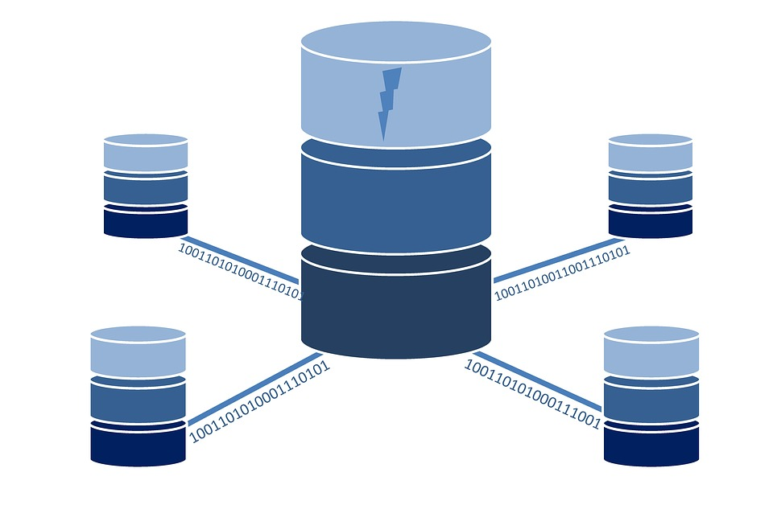

#### Bazy danych


---

##### Czym są relacyjne bazy danych?

Relacyjne bazy danych służą do przechowywania danych połączonych ze sobą relacjami. Charakterystyczne cechy baz danych to:

* Szybkie wyszukiwanie informacji
* Przechowywanie dużej ilości danych na małej powierzchni
* Prosta analiza zgromadzonych danych
* Przystępny dostęp i możliwość dostępu zdalnego
* Łatwe tworzenie kopii zapasowych
* Ułatwione zachowywanie spójności danych

---

##### CRUD

Skrót **CRUD** oznacza cztery podstawowe operacje wykonywane na
danych implementowane w aplikacjach bazodanowych
* **C – create** (tworzenie)
* **R – read** (odczyt)
* **U – update** (aktualizacja)
* **D – delete** (usuwanie)

---

#### Tabela

**Tabela** to wydzielony logicznie zbiór danych, zorganizowanych w formie zbioru składającego się z wierszy dzielonych na kolumny.


---

#### Relacja

**Relacja** to logiczne połączenie pomiędzy między tabelami.


---

#### Klucz główny


Do jednoznacznej identyfikacji wierszy stosuje klucz główny (*ang.* **primary key**), czyli jedną z kolumn lub ich grupę, których wartości są unikatowe w całej tabeli (dzięki czemu jednoznacznie identyfikują wiersz(*ang.* **row**)).

---

#### Klucz obcy

Innym rodzajem klucza jest tzw. klucz obcy (*ang.* **foreign key**). Służy do wskazywania zależności pomiędzy danymi składowanymi w różnych tabelach. Na klucz obcy nałożony jest wymóg, że w tabeli wskazywanej musi istnieć wartość na którą wskazuje klucz. 

---

##### Typy danych SQL

Każda kolumna w tabeli musi posiadać określony typ:

* **Tekst** - CHAR, VARCHAR, BLOB, TEXT, ENUM, SET,...
* **Liczby całkowite** - BIT, TINYINT, BOOLEAN, SMALLINT, ...
* **Liczby zmiennoprzecinkowe** - DOUBLE, DECIMAL, ...
* **Data i czasu** - DATE, TIME, DATETIME, ...
* **Specjalne** - na przykład JSON

---

### **<span style="color:salmon">S</span>tructured <span style="color:salmon">Q</span>uery <span style="color:salmon">L</span>anguage**

Większość współczesnych relacyjnych baz danych korzysta z jakiejś wersji języka **SQL** pozwalającego wprowadzać zmiany w strukturze bazy danych, jak również zmiany danych w bazie i wybieranie informacji z bazy danych. 

Język ten opiera się na silniku bazy danych, który pozwala zadawać w języku **SQL** pewnego rodzaju pytania (kwerendy) i wyświetlać dane, które spełniają warunki zapytania. 

Zapytania **SQL** mogą także wykonywać operacje wstawiania danych, usuwania danych i ich aktualizacji. Język **SQL** zapewnia również zarządzanie bazą danych.

---

* **SQL** został stworzony w latach 70 w IBM.
* W roku 1986 została wydana pierwsza wersja standardu **ANSI-SQL**.
* Najnowsza wersja standardu to **SQL:2016**.

---

###### Podstawowe instrukcje to:

* **SHOW DATABASES;** - wyświetla bazy danych na serwerze
* **USE [nazwa bazy danych];** - wybiera bazę danych
* **SHOW TABLES;** - wyświetla tabele w wybranej bazie danych.
* **DESC [bazwa tabeli];** - wyświetla detale tabeli

---

Do bazy danych możemy łaczyć się przez narzędzia takie jak `Mysql Workbench`,
`IntelliJ` lub przez linię poleceń korzystając z narzędzia `mysql`.

Możemy się połączyć z bazą danych przy pomocy `mysql` używając polecenia:

```bash
mysql -u {użytkownik} -p'{hasło}' -h {host} -P {port} -D {nazwa bazy}
```

```bash
mysql -u school_user -p'pass' -h 0.0.0.0 -P 3306 -D school
```
---

## Data Query Language

---

##### Komentarze

```sql
# Jednoliniowy
-- Jednoliniowy
/* 
   Blokowy
   Wieloliniowy
 */
```

---

Podstawowe zapytanie  **SQL** pozwala pobrać kolumny z danej tabeli za pomocą słów kluczowych `SELECT` i `FROM`:

```sql
SELECT [kolumny] FROM [tabela]
```

```sql
SELECT * FROM students
SELECT id, first_name FROM students
```
---

Możemy ograniczyć liczbę wyników za pomocą `LIMIT` oraz przesuwać punkt startu za pomocą `OFFSET`.

```sql
SELECT * FROM [nazwa_tabeli] LIMIT [ilość_wierszy] OFFSET [punkt startu];
```

```sql
SELECT * FROM students LIMIT 5 OFFSET 5;
```

Możemy rówież wyświetlić tylko unikatowe wartości za pomocą `DISTINCT`.

```sql
SELECT DISTINCT first_name FROM students;
```

---

Aby nadać kolumnie inną nazwę (alias) używamy słowa kluczowego `AS` (można też je ominąć):

```sql
SELECT [nazwa_kolumn] AS [nowa_nazwa] FROM [nazwa_tabeli];
SELECT [nazwa_kolumn] [nowa_nazwa] FROM [nazwa_tabeli];

```

```sql
SELECT first_name AS imię FROM students;
SELECT first_name imię FROM students;
```

---

Aby ustalić kolejność wyników należy użyć słowa kluczowego `ORDER BY`:

```sql
SELECT * FROM [nazwa_tabeli] ORDER BY [nazwa_kolumny1, nazwa_kolumny2, ...];
```

```sql
SELECT * FROM students ORDER BY age, first_name;
```

Możemy kontrolować koleność sortowania danych za pomocą słów **ASC** - kolejność roznąca
oraz **DESC** malejąca. **ASC** jest domyślną kolejnością.

```sql
SELECT * FROM students ORDER BY age DESC;
```

---

###### Predykaty i filtrowanie danych
Pobierane dane możemy filtrować za pomocą słowa kluczowego `WHERE` do którego przekazujemy predykat:

* `=` i `<>` - operatory *równa się* i *różni się*. 
   ```sql
  SELECT * FROM students WHERE id = 9;
   ```
* `>`, `>=`, `<`, `<=` to operatory porównania.
   ```sql
  SELECT * FROM students WHERE age > 10;
   ```
* `IN` - operator sprawdzający czy wartość należy do zbioru.
   ```sql
  SELECT * FROM students WHERE name IN ('Jerzy', 'Kazimierz');
  ```

* `BETWEEN` sprawdzający czy wartość jest w zakresie.
 ```sql
 SELECT * FROM students WHERE age BETWEEN 15 AND 17;
 ```
---

* `LIKE` porównujący tekst z innym wyrażeniem tekstowym zawierającym znaki uniwersalne % (znak procenta), _ (znak podkreślenia)
   ```sql
  SELECT * FROM students WHERE name LIKE 'St_fan';
  SELECT * FROM students WHERE name LIKE 'Stefa%';
  SELECT * FROM students WHERE name LIKE '%efan';
  SELECT * FROM students WHERE name LIKE '%efa%';
   ```
Predykaty mogą być łączone za pomocą `OR` albo `AND`.
  ```sql
  SELECT * FROM students WHERE id = 9 OR id = 8;
  SELECT * FROM students WHERE first_name = 'Stefan' AND last_name= 'Bijak';
  ```
Możemy również negować predykaty za pomocą `NOT`.
  ```sql
 SELECT * FROM students WHERE id NOT BETWEEN 3 AND 6;
  ```
---

#### NULL

**NULL ** specjalny znacznik w języku SQL, wskazujący, że dana nie istnieje w bazie danych.
Aby kolumna mogła przyjnować wartości NULL musi mieć ustawiony atrybut NULLABLE.

Filtrując po wartości **NULL** musimy korzystać ze specjalnego predykatu **IS / IS NOT**:

 ```sql
 SELECT * FROM students WHERE age IS NOT NULL;
 SELECT * FROM students WHERE age IS NULL;
  ```

---
#### Funkcje SQL

Na kolumnach możemy wykonywać operacje używając funkcji:  

```sql
   SELECT [nazwa_funkcji(kolumna)] FROM [tabela];
```

```sql
   SELECT LENGTH(first_name) AS name_length FROM students;
```

---
Podstawowe funkcje związane z tekstem:

* **CONCAT(argument1, ...)** - łączy ze sobą łańcuchy tekstowe
  ```sql
  SELECT CONCAT(p.prefix, '-', p.number) FROM phone p-- +48-514444654
  ```
* **LENGTH(argument)** - zwraca długość argumentu
* **SUBSTRING(argument,pozycja, długość)** - zwraca argument począwszy od wskazanej pozycji o zadanej ilości znaków
  ```sql
  SELECT SUBSTRING('raz dwa trzy', 5, 3)
   ```
* **LOWER(argument)** - zwraca argument pisany małymi literami
* **UPPER(argument)** - zwraca argument pisany dużymi literami

---
Podstawowe funkcje związane z tekstem c.d.:

* **REPLACE(tekst, do_zamienienia, zamiennik)** - zamienia tekst
  ```sql
  SELECT REPLACE('raz dwa', 'raz', 'zero') -- zero dwa
  ```
* **LPAD(argument, długość, znaki)** - zwraca argument uzupełniony do lewej strony określonym ciągiem znaków
  ```sql
  SELECT LPAD('123', '6', '0') -- 000123
  ```
* **LTRIM(argument)** - usuwa znaki spacji z lewej strony argumentu
* **RPAD(argument, długość, znaki)** - zwraca argument uzupełniony do prawej strony określonym ciągiem znaków
* **RTRIM(argument)** - usuwa znaki spacji z prawej strony argumentu

---

Podstawowe funkcje związane z datą i czasem:

* **CURRENT_DATE()** - zwraca bieżącą datę
* **CURRENT_TIME()** - zwraca bieżący czas
* **CURRENT_DATETIME()** albo **NOW()** - zwraca bieżącą datę z czasem
* **DATE(argument)** - zwraca datę z przekazanego tekstu
  ```sql
  SELECT DATE('2019-04-04')
  ```

---

Podstawowe funkcje związane z datą i czasem c.d:

* **DATE_ADD(data, interwał)** - dodaje określony interwał do daty
  ```sql
  SELECT DATE_ADD(date, INTERVAL 20 DAY)
  ```
* **DATEDIFF(wyrażenie_1,wyrażenie_2)** - zwraca ilość dni pomiędzy datami przekazanymi jako argumenty funkcji
    ```sql
    SELECT DATEDIFF(date, CURRENT_DATE())
    ```
* **MONTH(data)** - pobiera miesiąc z przekazanego argumentu
  ```sql
  SELECT MONTH(date)
  ```
* **EXTRACT(wyrażenie)** -- wyciąga element z daty
  ```sql
  SELECT EXTRACT(DAY FROM CURRENT_DATE())
  ```

---

Datę możemy formatować za pomocą funkcji **DATE_FORMAT**:

```sql
SELECT DATE_FORMAT('2017-06-15', '%M %d %Y'); -- June 15 2
SELECT DATE_FORMAT('2017-06-15', '%W %M %e %Y'); -- Thursday June 15 2017
SELECT DATE_FORMAT(birthdate, '%d.%m.%Y') FROM employees; -- 18.12.1988
```

---

Podstawowe funkcje związane z liczbami

* **RAND()** - zwraca losową liczbę
* **ABS(liczba)** - zwraca moduł z liczby
* **SQRT(liczba)** - zwraca pierwiastek z liczby
  ```sql
  SELECT SQRT(25) -- 5
  ```
* **ROUND(liczba)** - zaokrągla liczbę do najbliższej liczby całkowitej
  ```sql
  SELECT ROUND(5.6) -- 6
  ```
* **FORMAT(liczba, ilość_miejsc)** - zaokrągla liczbę, do ilości miejsc po przecinku 
  ```sql
  SELECT FORMAT(3.355555, 2) -- 3.36
  ``` 
---

I inne:

* **GREATEST(arg1, arg2, ...)** - zwraca największy element
  ```sql
  SELECT GREATEST('zero', 'raz', 'dwa')
  ```
* **LEAST(arg1, arg2, ...)** - zwraca najmniejszy element element
* **COALESCE(arg1, arg2, ...)** - zwraca pierwszy argument, który nie jest nullem
  ```sql
  SELECT COALESCE(d.short_desc, d.long_desc, 'brak') FROM division d
  ``` 
---

#### Wyrażenie case

Wyrażenia `case` możemy użyć do zamiany (translacji) wyniku na inny.

Możemy dopasowaywać wartość do warunków:

```sql
SELECT
    CASE department.shortcut
        WHEN 'acc' THEN 'Accounting'
        WHEN 'eng' THEN 'Engineering'
        WHEN 'r&d' THEN 'Research'                   
     END
 FROM department;
```

Możemy użyć również wersji z dowolnym predykatem:

```sql
SELECT
    CASE
        WHEN age < 18 THEN 'Forbidden'
        ELSE 'Ok'
    END
FROM children;
```

---

#### Agregacje wyników

Wyniki możemy agregować za pomocą słowa kluczowego `GROUP BY` i funkcji agregującej:

* **COUNT(kolumna)** - liczy wyniki w grupie
* **SUM(kolumna)** - sumuje wyniki w grupie
* **MIN(kolumna)** - wyznacza minimalną wartość w grupie.
* **MAX(kolumna)** - wyznacza minimalną wartość w grupie.
* **AVG(kolumna)** - wyznacza średnią wartość w grupie.

---

```sql
SELECT [kolumna_grupująca1,kolumna_grupująca2, ...],[nazwa_funkcji(kolumna)] 
FROM [tabela] 
GROUP BY [kolumna_grupująca1, kolumna_grupująca2, ...]
```

```sql
SELECT year, AVG(value) AS avg_income 
FROM incomes 
GROUP BY year;
```
```sql
SELECT employee, year, AVG(value) AS avg_income 
FROM incomes 
GROUP BY employee, year;
```
---

Możemy wykonać także filtrowanie wyników po agregacji używając klauzuli `HAVING`:

```sql
SELECT employee, year, AVG(value) AS avg_income 
FROM incomes 
GROUP BY employee, year HAVING avg_income > 2000;
```
---

#### Podzapytania
Podzapytanie (ang. *subquery*) to instrukcja **SELECT** zagnieżdżona w innej instrukcji SQL, która dostarcza dla tej
drugiej danych wejściowych.

---

Podzapytanie **zagnieżdżone** występuje wtedy, gdy wynik wewnętrznego zapytania zostaje przekazany do zewnętrznego zapytania.
Możemy używać ich w predykatach:
```sql
SELECT surname, salary
FROM employee
-- podzapytanie musi wzrócić jeden wynik w jednej kolumnu
WHERE salary > (SELECT avg(salary) FROM employee)
```
```sql
SELECT surname, salary
FROM employee
-- podzapytanie może zwrócić więcej wyników,
-- ale ciągle musi być to jedna kolumna
WHERE name IN (SELECT name FROM managers) 
```
---

Możemy również użyć podzapytania, żeby utworzyć kolumnę.

```sql
-- podzapytanie tworzące kolumn avg_salry musi zwrócić jeden wynik
-- w jednej kolumnie
SELECT surname, salary, (SELECT avg(salary) FROM employee) AS avg_salary
FROM employee
```

Podzapytanie może być użyte jako tabela stworzona *ad-hoc*:

```sql
SELECT 
   newly_hired_employees.surname, 
   newly_hired_employees.salary
FROM (
   SELECT surname, salary, position
   FROM employee 
   WHERE hired_on > DATE('2018-01-01')
) newly_hired_employees
WHERE position = 'manager'
```

---

* Podzapytanie **skorelowane** występuje, gdy zapytanie zewnętrzne pobiera wszystkie ewentualne wiersze wyniku,
  a następnie dla każdego wiersza zapytania zewnętrznego uruchamiane jest zapytanie wewnętrzne.

```sql
SELECT surname, salary
FROM employee e1
WHERE e1.salary > (SELECT avg(salary)
                   FROM employee e2
                   WHERE e2.dept_id = e1.dept_id)
```
---

Operator **EXISTS** zwraca prawdę jeżeli podzapytanie zwróci co najmniej jedną wartość.

```sql
SELECT name
FROM suppliers
WHERE EXISTS (
    SELECT product_name 
    FROM products 
    WHERE products.supplier_id = suppliers.id AND price < 20
); 

```
---

Operator **ALL** zraca *true* tylko jeżeli warunek jest spełniony dla wszystkich wierszy zapytania.

```sql
SELECT name
FROM products
WHERE id = ALL (SELECT product_id FROM orders WHERE order = 10 OR order = 2); 
```

Operator **ANY** zraca *true* tylko jeżeli przynajmniej warunek jest spełniony dla wszystkich wierszy zapytania.

```sql
SELECT name
FROM products
WHERE id = ANY (SELECT product_id FROM orders WHERE order = 10); 
```

---

#### Złączenia

Złączenia (ang. *joins* ) oraz unie (ang. *unions* ) pozwalają na horyzontalne lub wertykalne łączenie danych w określony sposób.

---

###### CROSS JOIN

```sql
SELECT [kolumny...]
FROM [tabela_1]
CROSS JOIN [tabela_2];
```

```sql
SELECT emp_no, first_name, last_name, dept_name
FROM employees 
CROSS JOIN departments
```


---

###### INNER JOIN

```sql
SELECT [kolumny...] FROM [tabela_1]
JOIN [tabela_2]
ON [tabela_1.kolumna] = [tabela_2.kolumna];
```

```sql
SELECT e.emp_no, e.first_name,
e.last_name, d.dept_name
FROM employees e
JOIN departments d
ON e.dept_no = d.dept_no;
```


Note: Aliasy!
---

###### LEFT JOIN

```sql
SELECT [kolumny...] FROM [tabela_1]
LEFT JOIN [tabela_2]
ON [tabela_1.kolumna] = [tabela_2.kolumna];
```

```sql
SELECT e.emp_no, e.first_name,
e.last_name, d.dept_name
FROM employees e
LEFT JOIN departments d
ON e.dept_no = d.dept_no;
```


---

###### RIGHT JOIN

```sql
SELECT [kolumny...] FROM [tabela_1]
RIGHT JOIN [tabela_2]
ON [tabela_1.kolumna] = [tabela_2.kolumna];
```

```sql
SELECT e.emp_no, e.first_name,
e.last_name, d.dept_name
FROM employees e
RIGHT JOIN departments d
ON e.dept_no = d.dept_no;
```


---

###### UNION

```sql
SELECT [kolumny...]
FROM [tabela1]
UNION
SELECT [kolumny...]
FROM [tabela2]
```

```sql
SELECT first_name, last_name
FROM employees
UNION
SELECT first_name, last_name
FROM external_employees;
```


---

###### UNION ALL

```sql
SELECT [kolumny...]
FROM [tabela1]
UNION ALL
SELECT [kolumny...]
FROM [tabela2]
```

```sql
SELECT first_name, last_name
FROM employees
UNION ALL
SELECT first_name, last_name
FROM external_employees;
```


---

### Rodzaje relacji 

---

##### Jeden do jednego

Relacja między jedną encją, a druga. W bazie relacyjnej oznacza, że jedna tabela posiada klucz obcy do drugiej tabeli.


---

##### Jeden do wielu

Relacja między jedną encją, a wieloma. W bazie relacyjnej modelowana identycznie jak relacja jeden do jeden.


---

##### Wiele do wielu

Relacja między wieloma encjami, a wieloma. W bazie relacyjnej modelowana za pomocą dodatkowej tabeli.


Tabele *wiele-do-wielu* często posiadają **złożone klucze główne**.

---

#### Common Table Expressions

**CTE** pozwalają nam na stworzenie nazwanych podzapytań do których możemy potem odwoływać sie jak do tabel.

```sql
WITH average_salaries AS (
    SELECT
        e.name
        AVG(s.salary) AS avg_salary
    FROM employees e
    JOIN salaries s ON e.id = s.employee_id
    GROUP BY e.name
) SELECT
     name,
     avg_salary
  FROM average_salaries
  WHERE avg_salary > 2000
  UNION
  SELECT
    name,
    avg_salary
  FROM average_salaries
  WHERE avg_salary < 1000
```

---

Możemy tworzyć również rekurencyjne podzapytania **CTE**.

```sql
WITH RECURSIVE days AS (
    SELECT CURRENT_DATE AS day
    UNION ALL
    SELECT DATE_ADD(day, INTERVAL 1 DAY) AS day
    FROM days
    WHERE day < DATE_ADD(CURRENT_DATE, INTERVAL 10 DAY)
) SELECT * FROM days;
```
---

### SQL Window functions

---

**Window functions** pozwalają nam wykowynywać agregacje, które nie wpływają na resztę zapytania.

```sql
SELECT [kolumna1, kolumna2, ...],
    funkcja({arg1, arg2, ...}) 
    OVER (PARTITION BY [kolumna1, kolumn2, ...] 
    ORDER BY [kolumna1, kolumn2, ...])
FROM [tabela];
```

```sql
SELECT 
    depname,
    salary,
    avg(salary) OVER (PARTITION BY depname)
FROM empsalary;
```

```sql
SELECT 
   depname, 
   salary,
   rank() OVER (PARTITION BY depname ORDER BY salary DESC, empno)
FROM empsalary;
```

---

```sql
SELECT
  f.id, f.release_year, f.category_id, f.rating,
  AVG(rating) OVER (PARTITION BY release_year) AS year_avg
FROM films f
```


---

##### Przykładowe window functions:

* **SUM** - wyznacza sumę wartości w oknie
* **AVG** - wyznacza średnią wartość w oknie
* **COUNT** - oblicza ilość wierszy w oknie
* **RANK** - wyznacza ranking wierszy, jeżeli więcej niż jeden wierwsz otrzymuje dany numer, to kolejne są odpowiednio pominięte 
* **DENSE_RANK** - wyznacza ranking wierszy bez pomijania numerów
* **ROW_NUMBER** - zwraca numer wiersza
* **LAG** - zwraca wartość z poprzedniego wiersza
* **LEAD** - zwraca wartość z kolejnego wiersza


---

## Data Manipulation Language

---

##### Dodawanie danych

```sql
INSERT INTO [nazwa_tabeli]([kolumny...]) VALUES ([wartości...])
```
```sql
INSERT INTO department(id, name, city) VALUES(10, 'ACCOUNTING', 'NEW YORK');
INSERT INTO department VALUES(11, 'LEGAL', 'LOS ANGELES');
```

Możemy też wykonywać `insert` za pomocą danych zwróconych przez zapytanie:

```sql
INSERT INTO department SELECT DEPTNO, DNAME, LOC FROM migrated_department;
```
---

#### Skąd sie biorą id?
Możemy jawnie zadeklarowąć jaki **id** ma zostać użyty w insercie.
  ```sql
  INSERT INTO department(id, name) VALUES(10, 'ACCOUNTING');
  ```
---

Możemy też pozostawić na bazie danych obowiązek wygenerowania klucza.
  Strategia generowania klucza zależy od bazy danych:
  
   * poprzez wywołanie sekwencji (dla *Oracle*, *PostgreSQL*, itd.)
     ```sql
     INSERT INTO department(id, name) VALUES(dep_seq.nextval, 'ACCOUNTING');
     ``` 
   
   * poprzez stworzenie autoinkrementującej się kolumny (dla *MySQL*, *MariaDB*, itd.)
     oraz pozostawienie kolumny w *insercie* pustej:
     ```sql
     INSERT INTO department(name) VALUES('ACCOUNTING');
     ```


---

##### Uaktualnianie danych

```sql
UPDATE [nazwa tabeli]
SET [nazwa_kolumny1]=[wartość1], [nazwa_kolumny2]=[wartość2], ...
WHERE [predykat]
```
```sql
UPDATE department
SET dept_name = ’Sales’,
manager = ’Zosia’
WHERE dept_name = ’Finance’;
```
```sql
UPDATE department AS src, department AS target 
SET target.description = src.description
WHERE target.manager_id = src.manager_id
```

---

##### Usuwanie danych:

Aby usunąć konkretne dane używamy `DELETE`:

```sql
DELETE FROM students WHERE id = 9
```

`TRUNCATE` usuwa wszystkie dane z tabeli i resetuje autoinkrementujące się wartości/sekwencje.

```
TRUNCATE TABLE students;
```

Note: Truncate kasuje też sekwencje, delete będzie wymagać WHERE
---

## Data definition language

---

##### Zarządzanie bazami danych

Stworzenie nowej bazy danych:

```sql
CREATE DATABASE {IF NOT EXISTS} [nazwa_bazy_danych];
```

Usunięcie istniejącej bazy danych:

```sql
DROP DATABASE {IF EXISTS} [nazwa_bazy_danych]
```

---

#### Tworzenie i usuwanie tabeli

Tabelę tworzymy przy pomocy `CREATE TABLE`.

```sql
CREATE TABLE [nazwa] ([definicje kolumn] [definicje kluczy])
```

```sql
CREATE TABLE employee (
  EMPNO SMALLINT UNSIGNED NOT NULL AUTO_INCREMENT,
  ENAME VARCHAR(40) NOT NULL,
  JOB VARCHAR(20) NOT NULL,
  HIREDATE date,
  SAL DECIMAL(7,2),
  DEPTNO SMALLINT(5) UNSIGNED,
  PRIMARY KEY (EMPNO),
  FOREIGN KEY(DEPTNO) REFERENCES department (DEPTNO)
);
```
---

Tabelę możemy usunąć przy pomocy `DROP`.

```sql
DROP TABLE employee;
```

---

#### Uaktualnianie tabeli

```sql
ALTER TABLE [nazwa] [operacja];
```

```sql
ALTER TABLE department ADD DESCRIPTION VARCHAR(100);
```

```sql
ALTER TABLE department MODIFY DESCRIPTION VARCHAR(200);
```

```sql
ALTER TABLE department RENAME COLUMN DESCRIPTION TO DESCR;
```

```sql
ALTER TABLE department DROP COLUMN DESCR;
```

---

#### Atrybuty kolumn

* **NOT NULL** - kolumna nie może przyjmować wartości null
* **UNIQUE** - kolumna będzie przechowywać tylko unikalne wartości
* **AUTO_INCREMENT** - kolumna typu liczbowego, która wstawia w miejsce *NULL*
                       liczby z sekwencji
* **CHECK** - kolumna będzie przyjmować tylko wartości spełniające predykat

---

#### Klucze główne i obce
Możemy określić, które kolumny są kluczami za pomocą atrybutów:

```sql
CREATE TABLE employee (
  id INT AUTO_INCREMENT PRIMARY KEY,
  department_id INT REFERENCES depardment(id)
);
```

Możemy też zdefiniować je jako ostatnie wyrażenie przy tworzeniu tabeli:

```sql
CREATE TABLE employee (
  id INT AUTO_INCREMENT,
  department_id INT,
  PRIMARY KEY(id),
  FOREIGN KEY(department_id) REFERENCES department(id)
);
```
---

W ten sposób możemy też tworzyć złożone klucze:

```sql
CREATE TABLE employee_x_departments (
  employee_id INT,
  department_id INT,
  PRIMARY KEY(employee_id, department_id),
  FOREIGN KEY(department_id) REFERENCES department(id),
  FOREIGN KEY(employee_id) REFERENCES employee(id)
);
```

---

#### Widoki

**Widok** (zwany również wirtualną tabelą, ang. *view*) składa się ze zbioru wierszy
zwracanych w wyniku wykonania określonego zapytania SQL. Widok **nie stanowi kopii danych** reprezentowanych przez zapytanie.

* Widoki mogą ukrywajać złożone złączenia pobierające danych z kilku tabel
* Umożliwiają ograniczenia dostępu do kolumn (np. ukrywanie wysokości pensji)

**Widok zmaterializowany ** (ang. *materialized view*) **tworzy kopię danych** z zapytania wykorzystanego do jego stworzenia.
Przy każdej zmianie tabeli źródłowych widok jest uaktualniany.

---
Widok tworzymy zapytaniem:
```sql
CREATE VIEW OR REPLACE [nazwa_widoku] ([kolumny])
AS SELECT [zapytanie];
```

Z widoku korzystamy jak z tabeli:
```sql
SELECT [kolumny] FROM [widok];
```

Aby usunąć widok, używamy `DROP`:
```sql
DROP VIEW [widok];
```
---

##### Wyzwalacze
**Wyzwalacz** (ang. *trigger*) to procedura, która jest wykonywana w odpowiedzi na zajście w bazie danych określonych zdarzeń, takich jak:

* wstawianie danych (**INSERT**)
* modyfikowanie danych (**UPDATE**)
* usuwanie danych z tabel (**DELETE**)

Zdarzenia te mogą być wykonywane bezpośrednio przed operacją lub tuż po niej.

---

##### Wyzwalacze możemy stosować do:

* weryfikacji danych przed zapisem w bazie
* automatyzacja operacji (jak wstawienie daty ostatniej modyfikacji)

---
Wyzwalacz dodajemy używając `CREATE TRIGGER`:
```sql
CREATE TRIGGER [nazwa_wyzwalacza]
{ BEFORE | AFTER }
{ INSERT | UPDATE | DELETE }
ON [nazwa_tabeli]
FOR EACH ROW
[instrukcja/instrukcje_do_wykonania]
```
Jeśli wyzwalacz wykonuje więcej niż jedną instrukcje umieszcza się te instrukcje pomiędzy słowami kluczowym **BEGIN** i **END**.

```sql
CREATE TRIGGER set_grade BEFORE UPDATE ON marks
    FOR EACH ROW
BEGIN
    IF new.points >= 90 THEN
        SET new.grade = 'EXCELLENT';
    ELSEIF new.points >= 45 AND new.pooints < 90 THEN
        SET new.gtrade = 'OK';
    ELSE
        SET new.grade = 'UNSATISFACTORY';
    END IF;
END;
```

---

Możemy też usunąć istniejący wyzwalacz:
```sql
DROP TRIGGER [nazwa_wyzwalacza];
```
---

#### Indeksy

Indeksy to dodatkowe struktury dazy danych definiowane dla konkretnych kolumn.

* Indeksy zajmują miejsce na dysku.
* Przyspieszają wyszukiwanie danych.
* Przyspieszają sortowanie danych.
* Spowalniają aktualizację danych w kolumnie.

---

###### Tablice hashy

* Są bardzo szybkie.
* Mogą działąć tylko na operatorze równości.

<br/>

###### Zrównoważone drzewa binarne

* Jest to domyślna struktura dla indeksu w większości przypadków.
* Pozwala wyszukiwać dane w czasie logarytniczmnym,
* Pozawala wyszukiwać dane używając operatorów porównania.

---

###### Tworzenie indeksów

```sql
CREATE {UNIQUE|FULLTEXT} INDEX [nazwa_indeksu] ON [kolumn] {USING BTREE};
```

```sql
CREATE INDEX autid ON newauthor(aut_id);
CREATE UNIQUE INDEX newautid ON newauthor(aut_id);
CREATE UNIQUE INDEX newautid ON newauthor(aut_id) USING BTREE;
```

```sql
DROP INDEX [nazwa_indeksu] ON [nazwa_tabeli];
```

Note: SELECT SQL_NO_CACHE * FROM students WHERE first_name LIKE '%yna';
---

##### Procedury

```sql
CREATE PROCEDURE [nazwa_procedury] ([parametr[, ...]])
[kod procedury]
```

```sql
DROP PROCEDURE [nazwa_procedury];
```

```sql
CREATE PROCEDURE get_data(IN product_number CHAR(8), OUT count INT)
SELECT COUNT(*) FROM products WHERE product = product_number INTO count;
```

```sql
CALL get_data();
SELECT @count;
```

---

### Funkcje

```sql
CREATE FUNCTION [nazwa_funkcji] ([parametr[, ...]]) RETURNS [typ] [cechy, ...]
[kod_funkcji]
```

---

Jeżeli funkcja zwraca zawsze ten sam wynik dla tych samych parametrów, to 
możemy ją oznaczyć jako deterministyczną za pomocą atrybutu **DETERMINISTIC**.

```sql

```

---

```sql
DROP FUNCTION [nazwa_funkcji];
```

---

## Data control language

---

##### Zarządzanie użytkownika i uprawnieniami

Tworzenie nowego użytkownika:
```sql
CREATE USER 'user'@'localhost' IDENTIFIED BY 'pass';
CREATE USER 'user'@'192.168.1.204' IDENTIFIED BY 'pass';
```

Usuwanie użytkownika:

```sql
DROP USER użytkownik;
```
---

Nadanie uprawnień:
```sql
GRANT [rodzaj_uprawnienia] ON [typ_obiektu] TO [uzytkownik];
```
Przeładowania uprawnień:

```sql
FLUSH PRIVILEGES;
```

Odbieranie uprawnień:
```sql
REVOKE [rodzaj_uprawnienia] ON [typ_obiektu] FROM [uzytkownik];
```

```sql
CREATE USER 'james'@'localhost' IDENTIFIED BY 'bond';
GRANT SELECT, INSERT, UPDATE ON employees.department TO james;
GRANT SELECT(name), UPDATE(job) ON employees.employee TO james@localhost;
GRANT ALL PRIVILEGES ON departments.* TO james;
REVOKE INSERT ON employees.dept FROM john;
```

---
##### Rodzaje uprawnień

* **SELECT** - odczyt danych z bazy
* **INSERT** - dodawanie rekordów do bazy danych
* **DELETE** - usuwanie rekordów z bazy danych
* **UPDATE** - modyfikowanie istniejących rekordów
* **CREATE** - tworzenie baz danych i tabel
* **DROP** - usuwanie baz danych i tabel
* **ALTER** - zmiana struktury tabel
* **GRANT** - przyznawanie uprawnień
* **ALL PRIVILEGES** – wszystko powyższe

---

### Normalizacja bazy danych

**Normalizacja** to proces organizowania danych w bazie danych. Obejmuje to tworzenie tabel i ustanawianie relacji między tymi tabelami zgodnie z regułami opracowanymi w celu zarówno ochrony danych, jak i zapewnienia większej elastyczności bazy danych przez wyeliminowanie nadmiarowości i niespójnych zależności.


---

#### Pierwsza postać normalna 1NF

Tabela jest w pierwszej postaci normalnej gdy pojedyncze pole tabeli zawiera informacje elementarną.


---

### Druga postać normalna 2NF

Tabela jest w drugiej postaci normalnej jeśli przechowuje dane dotyczące tylko jednej klasy obiektów.


---

### Trzecia postać normalna 3NF


W trzeciej postaci normalnej żaden atrybut nie będący częścią klucza nie zależy od innego atrybutu nie będącego częścią klucza.


---

##### Transakcje

**Transakcja** to zbiór operacji wykonywanych na bazie danych traktowanych jako jedna całość.

Transakcje uznaje się za zakończoną pomyślnie jeśli udało się prawidłowo
wykonać **wszystkie** wchodzące w jej skład operacje.
Jeśli którakolwiek z operacji zakończyła się niepowodzeniem, to całą transakcję
uznaje się za wykonaną nieprawidłowo.

Poprawna transakcja jest **zatwierdzana** w bazie danych (ang.&nbsp;*committed*),
a wprowadzone przez nią zmiany są widoczne dla innych procesów bazy danych.
Niepoprawna transakcja natomiast jest wycofywana (ang. *rolled-back*),
a wszystkie wprowadzone przez nią zmiany są anulowane.

---

* **Niepodzielnosć** (ang. *atomicity*) oznacza, że wszystkie operacje wchodzące w skład transakcji muszą zostać
wykonane poprawnie. W przeciwnym przypadku wszyskie operacje zostaną wycofane.
* **Spójność** (ang. *consistency*) Jeżeli nie powiedzie się zmiana stanu bazy danych to 
wraca ona do stanu sprzed rozpoczęcia transakcji (stanu spójnego).
* **Izolacja** (ang. *isolation*) oznacza, że wszystkie operacje wykonywane w ramach jednej 
transakcji muszą zostać odseparowane od reszty systemu aż do zatwierdzenia transakcji.
* **Trwałość** (ang. *durability*) oznacza, że  zatwierdzane dane muszą być zapisane w sposób
trwały, tak aby w przypadku awarii istniała możliwość przywrócenia zawartości bazy do prawidłowego stanu.

---

Standard **SQL-92** definiuje następujące cztery poziomu izolacji transakcji:
* **read uncommited** - transakcja może czytać niezatwierdzone dane czyli dane zmienione przez inną transakcję, która jest dalej wykonywana.
* **Read commited** - transakcja nie może czytać niezatwierdzonych danych. Dane aktualnie zmieniane przez inne transakcje nie mogą być odczytywane.
* **Repetable read** - transakcja nie może zmieniać danych odczytywanych przez inną transakcję.
* **Serializable** -transakcja ma wyłączność na odczyt i aktualizację danych. Inne transakcje nie mogą ani odczytywać, ani zapisywać tych samych
danych. Transakcja blokuje przetwarzany zakres wierszy aż do momentu jej zakończenia.

---

<div style="display: flex; justify-content: center; align-items: center;">
    &nbsp;&nbsp;&nbsp;[krzysztof.atlasik@pm.me](mailto:krzysztof.atlasik@pm.me)
</div>
